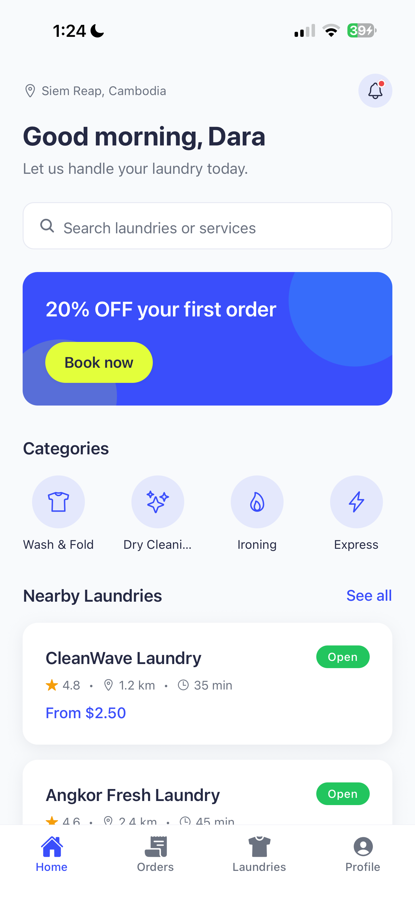

# WashGo

A modern on-demand laundry pickup and delivery platform built with **React Native**, **Expo**, and **TypeScript**.

WashGo enables customers to discover nearby laundries, schedule pickups, select laundry services, and track their orders through a clean and intuitive mobile experience.

This repository contains the customer mobile application developed as both a software engineering portfolio project and a university thesis.

---

# Demo

A demonstration video and presentation are included with the interview submission.

---

# Screenshots

> Replace the placeholders below with your application screenshots.

| Login | Home |
|-------|------|
|  |  |

| Laundry Details | Services |
|-----------------|----------|
|  |  |

| Pickup | Order Tracking |
|---------|----------------|
|  |  |

---

# Implemented Features

- Customer authentication interface
- Browse nearby laundries
- Search laundries and services
- View laundry details
- Multi-service selection
- Pickup scheduling
- Interactive map for pickup location
- Order summary
- Order tracking timeline
- Light & Dark Mode
- English & Khmer localization
- Responsive modern user interface

---

# Technology Stack

| Category | Technology |
|-----------|------------|
| Framework | React Native |
| Runtime | Expo |
| Language | TypeScript |
| Navigation | Expo Router |
| State Management | Zustand |
| Styling | Custom Design System |
| Maps | React Native Maps |
| Location | Expo Location |
| Theme | Light & Dark Mode |
| Localization | English & Khmer |

---

# Customer Journey

```text
Home
   │
   ▼
Choose Laundry
   │
   ▼
Laundry Details
   │
   ▼
Choose Services
   │
   ▼
Pickup Details
   │
   ▼
Order Summary
   │
   ▼
Order Tracking
```

---

# Project Structure

```text
app/
src/
components/
theme/
hooks/
utils/
data/
assets/
```

---

# Getting Started

### Clone the repository

```bash
git clone https://github.com/suon-rachana/washgo-mobile.git
```

### Install dependencies

```bash
npm install
```

### Start the development server

```bash
npx expo start
```

---

# Design Philosophy

WashGo follows a modern design language inspired by:

- Apple Human Interface Guidelines
- Uber
- Airbnb
- Stripe
- Linear

Design principles:

- Clean
- Minimal
- Spacious
- Modern
- Fast
- Accessible

---

# Future Roadmap

The current repository focuses on the customer mobile application.

Future development includes:

- Backend REST API
- Rider Mobile Application
- Laundry Partner Dashboard
- Administrator Dashboard
- Authentication Service
- Online Payment Integration
- Push Notifications
- Live GPS Tracking
- Real-Time Order Synchronization

---

# About the Project

WashGo is designed to modernize traditional laundry services by providing a convenient, reliable, and user-friendly digital platform.

This project is also being developed as part of my undergraduate thesis at **Angkor University**.

---

# License

This project is intended for educational and portfolio purposes.
